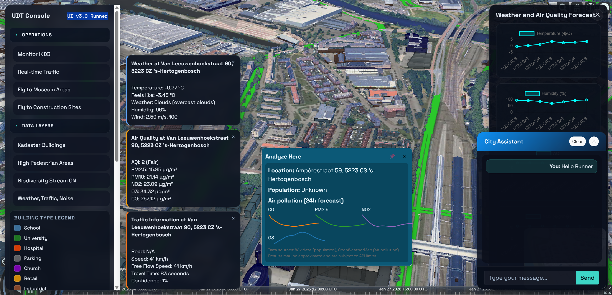
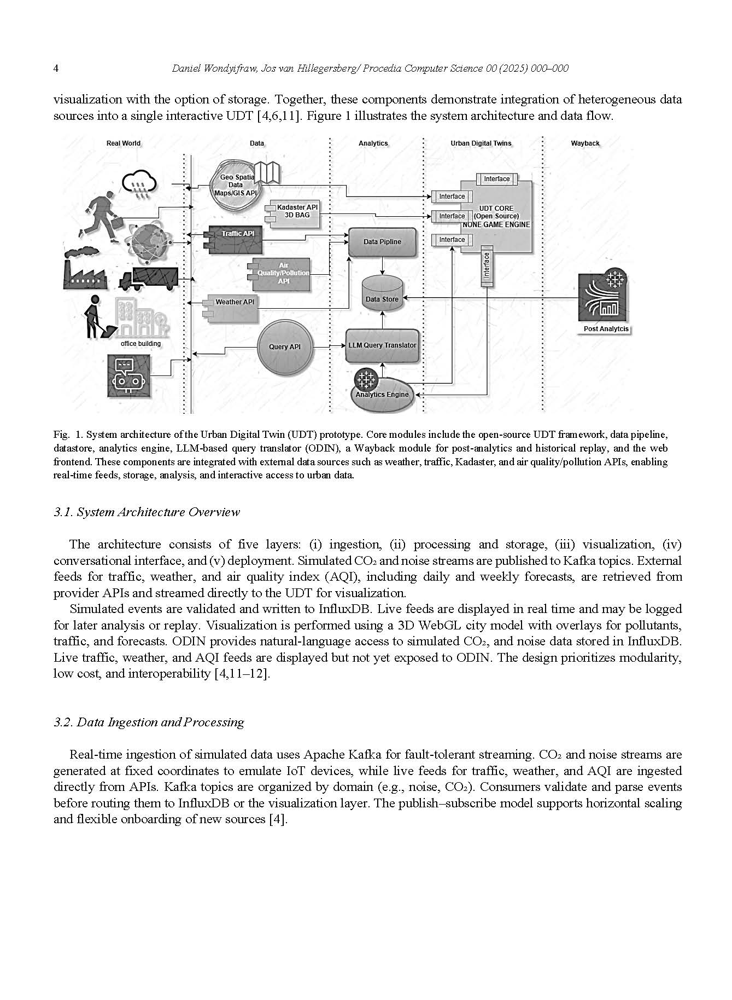
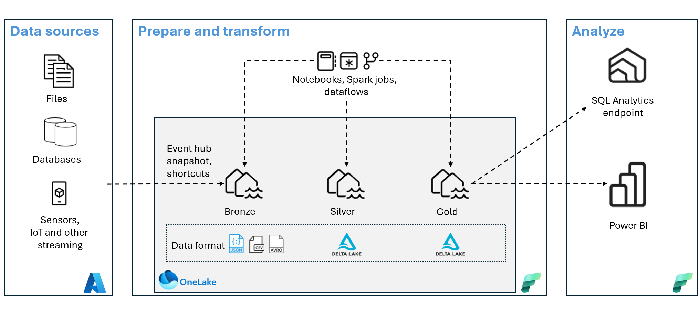

# Urban Digital Twin — Den Bosch (demoUIv3.o)

A production‑grade, static web console for the Den Bosch Urban Digital Twin. The application renders CesiumJS 3D content, overlays live data streams, and provides operational controls for traffic, air quality, weather, alerts, and analytics. This release is Runner 3.0 with a major upgrade to UI quality and overall stability.

Actively maintained for demo and research follow‑up (best‑effort maintenance, no production SLA).

## Start Here

1. Fill `config.json` with your API keys (keep secrets out of this repo).
2. Serve the repo as static files (example: `python -m http.server`).
3. If using a backend, set the Socket.IO URL in `realtimestream/kafka.js` (default: `http://localhost:5000`).
4. Open `http://localhost:8000` in your browser.

## Demo UI v3.0 Runner



## Architecture Overview

```
[Data Sources]
  - Kafka topics (traffic, sensors, environment)
  - External APIs (TomTom, OpenWeatherMap)
        |
        v
[Streaming Gateway]
  - Socket.IO backend (default: http://localhost:5000)
        |
        v
[Client Web App]
  - CesiumJS viewer
  - Real‑time stream handlers
  - UI controls (menus, panels, alerts)
```

## Architecture Visual



## Key Capabilities

- CesiumJS 3D city visualization
- Real‑time telemetry overlays (traffic, air quality, noise)
- Analytics side panel with charts
- Alerts and notification system (sound + UI)
- Chat assistant UI
- Minimap overview
- Museumkwartier fly‑to preset (UI v3.0 Runner)
- Biodiversity stream overlay (tree points)

## Setup

### Requirements

- Any static file server (example: `python -m http.server`)
- Modern browser (Chrome/Edge)

### Backend Integration (Optional)

- Socket.IO backend default: `http://localhost:5000` (see `realtimestream/kafka.js`).
- Kafka is upstream of the backend. This repo contains client‑side code only.

## Configuration

- `config.json` is loaded by `js/config.js`.
- External API keys are referenced in `js/main.js`.
- Store keys in `config.json` and read them after `configLoaded`. Keep `config.json` free of real secrets in this repo.

### Config Fields

| Field | Required | Description |
| --- | --- | --- |
| `CESIUM_TOKEN` | Yes | Cesium Ion access token. |
| `TOMTOMAPI` | Yes | TomTom traffic API key. |
| `AIRQUALITYAPI` | Yes | Air quality API key (also used as fallback for weather). |
| `WEATHERAPI` | No | Weather API key. If omitted, `AIRQUALITYAPI` is used. |
| `othersconf` | No | Optional placeholder for future settings. |

## Biodiversity Data Source (Trees)

ArcGIS REST service (Den Bosch geoportal):

```
https://geo.s-hertogenbosch.nl/geoproxy/rest/services/Externvrij/CO2/MapServer/11
```

Example query (Den Bosch envelope, WGS84):

```
https://geo.s-hertogenbosch.nl/geoproxy/rest/services/Externvrij/CO2/MapServer/11/query?where=1%3D1&outFields=*&f=json&geometryType=esriGeometryEnvelope&geometry=5.20,51.62,5.45,51.78&inSR=4326&outSR=4326&spatialRel=esriSpatialRelIntersects&resultRecordCount=800
```

## Museum Fly‑To Target

Museumkwartier center (Noordbrabants Museum + Design Museum):

```
51.6863, 5.3043
```

## Tests

Run the UI smoke test:

```
python scripts/ui_smoke_test.py
```

## Deployment Guidelines



### Static Hosting (Recommended)

1. Upload the repository to a static host (Nginx/IIS/object storage).
2. Serve the repo root and preserve relative paths.
3. Ensure correct MIME types for `.json`, `.js`, and `.css`.
4. Use HTTPS if external APIs require it.

### On‑Premises / Air‑Gapped

1. Host CesiumJS and CDN assets locally.
2. Replace external CDN links in `index.html` with local copies.
3. Update `config.json` to internal API endpoints and tokens.

### Backend Integration

1. Start the Socket.IO backend at `http://localhost:5000` or update the URL in `realtimestream/kafka.js`.
2. Confirm Kafka topics are available and mapped to the backend stream.
3. Validate the biodiversity endpoint and CORS access (or proxy it).

## Project Structure

```
[FILE] config.json
[FILE] index.html
[FILE] README.md
[DIR ] 3DModels/
[DIR ] architecture/
[DIR ] archive/
[DIR ] chatbotservice/
[DIR ] css/
[DIR ] dashboard/
[DIR ] js/
[DIR ] minimap/
[DIR ] notificationservice/
[DIR ] realtimestream/
[DIR ] scripts/
```

## File Map (Linked)

- [FILE] [index.html](index.html) — primary UI entry (UI v3.0 Runner)
- [FILE] [config.json](config.json) — runtime configuration
- [FILE] [js/main.js](js/main.js) — Cesium initialization + UI wiring
- [FILE] [js/config.js](js/config.js) — config loader (dispatches `configLoaded`)
- [FILE] [realtimestream/kafka.js](realtimestream/kafka.js) — Socket.IO stream client
- [FILE] [css/main.css](css/main.css) — main UI theme
- [DIR ] [notificationservice/](notificationservice) — alerts + notifications
- [DIR ] [chatbotservice/](chatbotservice) — assistant UI
- [DIR ] [architecture/](architecture) — UI/architecture images
- [FILE] [scripts/ui_smoke_test.py](scripts/ui_smoke_test.py) — smoke test

## License

[MIT License](LICENSE)
